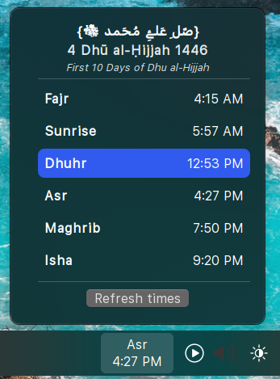
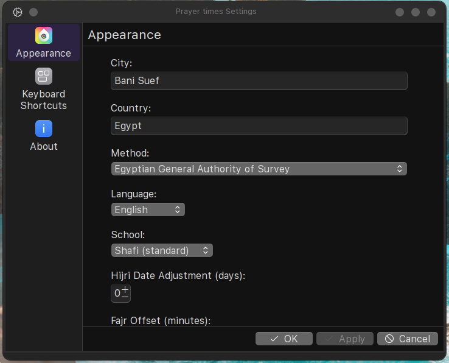

# Salaat Prayer Times for KDE Plasma

A simple and customizable widget for KDE Plasma 6 to display daily Islamic prayer times.
It features Hijri date, special Islamic occasion messages, configurable time offsets, and offline caching.

Calculations are based on the [AlAdhan API](https://aladhan.com/prayer-times-api).

 

## Key Features
* Daily prayer times with customizable offsets.
* Hijri date display with manual adjustment.
* Special Islamic date notifications (e.g., Ramadan, Eid).
* Offline caching for the current month.
* English and Arabic language support.
* 12/24 hour format & prayer notifications.

## Installation
*Just download from kde store or clone this repository.

## Configuration
Right-click the widget and select "Configure..." to set your location, calculation preferences, and display options.

---
Developed by Mazen. *(Based on initial work by Hamza Nasher-Alneam, with thanks to @ammar-elmesaly and @MrGueest for their contributions to the original project).*
